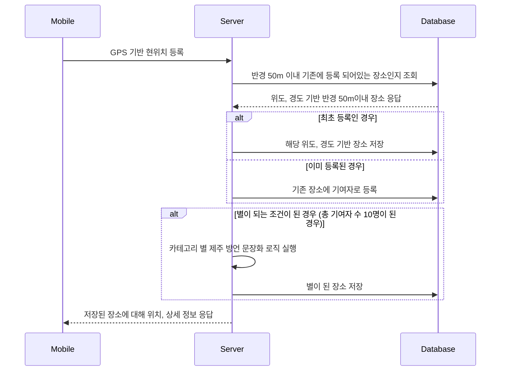

## 🥇 [Kakao x goorm] 구름톤 2기 대상

 

## 👫 팀 소개  
#### 팀명: 미리내
> ###### 기획자: [최연호](https://github.com/yeoncpp)   
> ###### 디자이너: 김은주   
> ###### 디자이너: [김동수](https://github.com/ehdtn)   
> ###### 안드로이드 개발자: [이준형](https://github.com/lijunhyeong)   
> ###### 백엔드 개발자: [김성수](https://github.com/nfl1ryxditimo12)   

 

## 💡 프로젝트 배경  
##### 이런 경험 혹시없으셨나요?
##### 여행 도중, 우연히 마주친 내 맘에 쏙드는 장소를 발견했을 때,
##### 기억해두고 싶지만 딱히 명칭이 없을 때,
##### 그 위치를 좀 더 특별하게 기억하고, 기록하기 !

 

## 🏃‍♂️ 서비스 흐름

### 🏞 장소 등록

 
 
### ⭐️ 별이 되는 과정
> 별이 되면 Private 장소에서 Public 장소로 변경되어, 누구나 볼 수 있는 장소가 됩니다.

 

### 💾 Database ERD

 

## 🛠 Backend 개발 환경

  &nbsp
  &nbsp
  &nbsp
  &nbsp

- [API 명세](https://choiyeonho.notion.site/API-bb42fdcc9b104b19b7cc73c2f6f41efa)
- [DB 초기 데이터](https://choiyeonho.notion.site/Static-Data-Set-6c9a6fc3bc1543798742eb66d23b8cd7)
